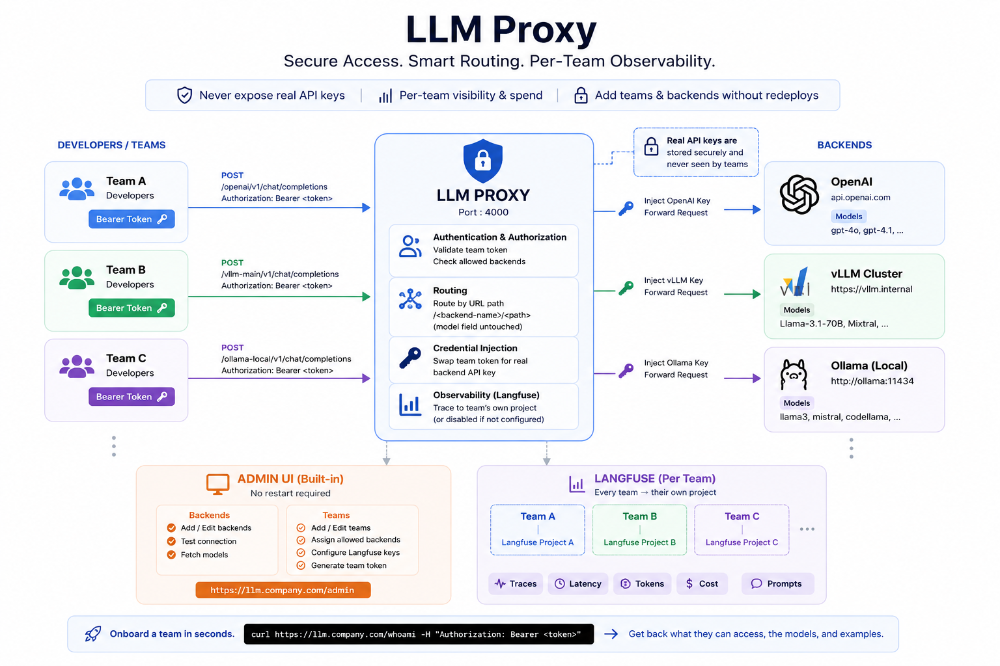

# LLM Proxy

A single, self-hosted entry point for every LLM your org uses — OpenAI, vLLM,
Ollama, or anything else that speaks the OpenAI API. Each team gets its own
bearer token, its own allow-list of backends, and its own Langfuse project
for tracing. Backends and teams are managed live from a built-in admin UI —
no redeploys to onboard a team or add a model server.  

  

```
 developers / team A  ──┐
 developers / team B  ──┼──►  LLM Proxy  ──┬──►  OpenAI
 developers / team C  ──┘     :4000        ├──►  vLLM  (self-hosted)
                               │            └──►  Ollama (self-hosted)
                               │
                               ├─► /admin        add backends & teams, no restart
                               └─► Langfuse       one project per team
```

## Contents

- [How it works](#how-it-works)
- [Quick start](#quick-start)
- [Onboarding a team](#onboarding-a-team)
- [Configuration reference](#configuration-reference)
- [API reference](#api-reference)
- [Tracing](#tracing)
- [Production deployment](#production-deployment)
- [Security](#security)
- [Troubleshooting](#troubleshooting)
- [Development](#development)

## How it works

- **Routing is by URL path.** A request to `POST /<backend>/v1/chat/completions`
  is forwarded to that backend's `base_url + /v1/chat/completions`, unchanged.
  Nothing is inferred from the `model` field — real model ids (e.g.
  `meta-llama/Llama-3-70b`) can themselves contain a `/`, so path-based
  routing is what stays unambiguous as you add more backends.
- **Auth is per team, not per backend.** A team's bearer token is checked
  against an allow-list of backend names; a team with no access to a backend
  gets a `403`, not a proxied request. Backends never see a team's token —
  the proxy swaps in that backend's own API key (or none, for a keyless
  Ollama/vLLM server) before forwarding.
- **Config is live, not baked into the image.** Backends, teams, and each
  team's Langfuse keys live in `data/config.json`, managed entirely through
  `/admin`. Editing them takes effect immediately — no container restart.
- **Tracing is per team.** Every `chat/completions` call is traced into
  *that team's own* Langfuse project (model, input/output, token usage,
  latency, tagged by backend). A team with no Langfuse keys configured just
  runs untraced — nothing else has to know or care.

## Quick start

```bash
cp .env.example .env
```

Generate an admin token and put it in `.env`:

```bash
openssl rand -hex 24   # → ADMIN_TOKEN=<paste this into .env>
```

That's the only required secret to boot. Everything else — backends, teams,
tracing — is added afterward through the admin UI.

```bash
docker compose up -d --build
```

Open `http://<this-host>:4000/admin` and paste in `ADMIN_TOKEN`. From there:

1. **Backends → Add backend** — name it, pick a type (OpenAI / vLLM / Ollama /
   generic OpenAI-compatible), give it a base URL and API key (if it needs
   one), then hit **Test connection & fetch models** to pull its live model
   list instead of typing it by hand.
2. **Teams → Add team** — name it, tick which backends it may call. Leave the
   token blank to auto-generate one. Optionally fill in that team's Langfuse
   host/public key/secret key right there to turn on tracing for it.
3. Hand the team its token (visible on its row, with a copy button) and point
   them at [Onboarding a team](#onboarding-a-team) below.

No backends or teams ship pre-configured — `backends.yaml` only holds
commented-out examples. The proxy is designed to start empty.

## Onboarding a team

The fastest way to hand a team what they need — instead of writing it up by
hand — is to point them at `/whoami` with their own token:

```bash
curl http://<this-host>:4000/whoami -H "Authorization: Bearer <their token>"
```

```json
{
  "team": "team-search",
  "backends": [
    {
      "backend": "ollama-local",
      "base_url": "http://<this-host>:4000/ollama-local",
      "models": ["llama3", "mistral"],
      "example_curl": "curl http://<this-host>:4000/ollama-local/v1/chat/completions -H \"Authorization: Bearer ...\" ..."
    }
  ]
}
```

The same information — plus a one-click copy button on the curl example — is
on that team's row in `/admin` → Teams → the `</>` button.

## Configuration reference

All of this lives in `.env` (copy `.env.example` to start). Nothing here is
committed — `.env` is gitignored.

| Variable | Required | Default | Purpose |
|---|---|---|---|
| `ADMIN_TOKEN` | **yes** | — | Bearer token guarding `/admin` and its API. The proxy refuses to start without it. |
| `PROXY_PORT` | no | `4000` | Port the app listens on inside the container. |
| `PROXY_TIMEOUT` | no | `600` | Seconds to wait for a backend response (kept long for slow local inference). |
| `PUBLIC_BASE_URL` | no | — | The domain teams actually use, e.g. `https://llm.company.com`. Used verbatim in `/whoami`'s curl examples and the admin UI's, instead of guessing from request headers. Set this once you have a real domain. |
| `CONFIG_DATA_PATH` | no | `data/config.json` | Where the live backend/team/tracing config is persisted. Mounted as a volume in `docker-compose.yml` so it survives container recreation. |
| `CONFIG_PATH` | no | `backends.yaml` | One-time migration seed, read **only** if `CONFIG_DATA_PATH` doesn't exist yet. |
| `OPENAI_API_KEY`, `LANGFUSE_HOST`, `LANGFUSE_PUBLIC_KEY`, `LANGFUSE_SECRET_KEY`, `TOKEN_TEAM_*`, … | no | — | Only consulted during that one-time migration, to seed backends/teams that `backends.yaml` names with `api_key_env` / `token_env`. Irrelevant once `data/config.json` exists — use `/admin` instead. |

### `backends.yaml`

Read exactly once, the first time the proxy boots against an empty `data/`
volume, to pre-populate backends and teams so you don't have to click
through the UI for a known starting set. It holds no secrets itself — only
the *names* of `.env` variables that do. After that first boot it's ignored;
edit live config at `/admin` instead. Ships with everything commented out, so
a fresh deploy starts with zero backends and zero teams. To re-seed from
scratch at any point: delete `data/config.json` and restart.

### `data/config.json`

The actual runtime state — every backend (base URL, type, API key, model
list) and every team (token, allowed backends, Langfuse keys) — written by
the admin API. Treat it like `.env`: it contains real secrets, it's
gitignored, and in Docker it lives on the `proxy-data` named volume so it
isn't lost on `docker compose up -d --force-recreate` or an image rebuild.

## API reference

| Endpoint | Auth | Purpose |
|---|---|---|
| `POST/GET/... /<backend>/<path>` | team token | The actual proxy. Forwards to `<backend>`'s `base_url + /<path>`. `chat/completions`-shaped calls are traced to that team's Langfuse project; everything else passes through untraced. |
| `GET /whoami` | team token | This team's allowed backends, their models, and a ready-to-run curl example. |
| `GET /v1/models`, `GET /models` | team token | OpenAI-style model list, filtered to what this team's token can reach. |
| `GET /health` | none | Liveness + a non-secret summary: backend names/types/models, team names/allowed-backends/tracing-on-off, `public_base_url`. |
| `GET /admin` | none (page is static; its API calls are gated) | The admin UI. |
| `GET/PUT/DELETE /admin/api/backends[/{name}]` | admin token | Manage backends. `PUT` upserts (create or update); an empty `api_key` on update keeps the existing one. |
| `POST /admin/api/backends/{name}/test` | admin token | Probes a backend with its own model-listing route (`GET /v1/models` for OpenAI/vLLM/generic, `GET /api/tags` for Ollama) and returns what it finds. |
| `GET/PUT/DELETE /admin/api/teams[/{name}]` | admin token | Manage teams. `PUT` upserts; blank `token` auto-generates one; blank `langfuse_secret_key` on update keeps the existing one. Deleting a backend still referenced by a team is refused (`409`) — remove it from the team(s) first. |

Bearer tokens are compared with a constant-time check (`hmac.compare_digest`)
so a near-miss guess doesn't leak timing information.

## Tracing

Tracing is Langfuse, configured **per team**, not globally. On a team's card
in `/admin` → Teams, fill in:

- **Langfuse host** — e.g. `https://cloud.langfuse.com` or your self-hosted URL
- **Public key** / **Secret key** — from that team's Langfuse project

Every `chat/completions` request from that team then traces into that
project: model, input/output, token usage, latency, tagged by model and
backend. Leave any of the three blank and that team simply runs untraced —
nothing else needs to change, since a team with no keys gets a Langfuse
client built with `tracing_enabled=False`, which no-ops every trace call
rather than needing a separate code path.

There's no global tracing switch by design: since each team owns its own
project, there's nothing meaningful for a proxy-wide toggle to control.

## Production deployment

```bash
docker compose up -d --build
```

- **Persistence**: `data/config.json` lives on the `proxy-data` named
  volume — recreating or rebuilding the container does not lose your
  backends/teams. Back that volume up like you would any other stateful
  data; it holds every secret the proxy currently knows.
- **Exposure**: `docker-compose.yml` binds to `127.0.0.1:4000` by default.
  Don't widen that until every team that should reach it has a real token —
  an unauthenticated proxy in front of a paid LLM API is an open budget.
  Put a reverse proxy (nginx, Caddy, Traefik, …) in front for TLS and your
  real domain, forwarding to `127.0.0.1:4000`.
- **`PUBLIC_BASE_URL`**: once you have that domain, set it in `.env`. It
  makes `/whoami` and the admin UI's curl examples show
  `https://llm.company.com/...` regardless of how the reverse proxy forwards
  headers, rather than depending on `X-Forwarded-Proto`/`X-Forwarded-Host`
  being set correctly.
- **Health check**: `GET /health` is what the container's own `HEALTHCHECK`
  and `docker-compose.yml`'s `healthcheck:` poll — point any external
  monitoring at the same endpoint.
- **Logs**: `docker-compose.yml` caps `json-file` logs at 10 MB × 3 files.
  Every proxied request logs one line — method, path, status, latency,
  model, team — to stdout (`docker logs -f langfuse-proxy`).
- **Rotating a backend's API key**: update it on that backend's card in
  `/admin` — takes effect on the next request, no restart.
- **Revoking a team**: delete it in `/admin` → Teams. Its token stops
  authenticating immediately.

## Security

- `ADMIN_TOKEN` is the master key to this whole deployment — it can read
  every backend API key and every team token through the admin API. Treat it
  like a root credential: generate it with `openssl rand -hex 24`, never
  commit it, rotate it if it's ever exposed.
- `.env` and `data/` are both gitignored (`.gitignore` in this repo). Only
  `.env.example` — which contains placeholders, not secrets — is meant to be
  committed.
- A team's proxy token is never forwarded to a backend; the proxy always
  substitutes that backend's own API key (or strips auth entirely for a
  keyless backend) before making the outbound request.
- Team tokens and admin token comparisons use `hmac.compare_digest`
  (constant-time) rather than `==`, to avoid leaking a match via timing.
- The catch-all proxy route validates the `backend` path segment against a
  reserved-name list (`admin`, `health`, `whoami`, `v1`, `models`) before
  ever reaching the routing table, so a backend can't be named to shadow a
  built-in endpoint.

## Troubleshooting

**Proxy won't start, exits immediately** — check the log line it prints;
it's almost always `ADMIN_TOKEN` missing from `.env`, or `backends.yaml`
referencing a variable that isn't set (only matters on a *first* boot with
no `data/config.json` yet).

**A team gets `403` on a backend it should have access to** — its token's
allow-list doesn't include that backend name. Check `/admin` → Teams → that
team's row, or `GET /whoami` with its token.

**A team gets `404`** — the `backend` segment in the URL doesn't match any
configured backend name. Check `/admin` → Backends, or `GET /health`.

**"Test connection" fails in the admin UI** — the proxy container needs
network access to that backend's `base_url`. If the backend is on the same
Docker host but not in this compose file, use the host's LAN IP or a shared
Docker network, not `localhost` (that resolves inside the proxy's own
container).

**Traces aren't showing up in Langfuse** — confirm that team's three
Langfuse fields are all filled in (`/admin` → Teams → edit) and that the
proxy container can reach that Langfuse host. A failed export logs
`Langfuse error: ...` to stdout without failing the actual request.

**Curl examples show the wrong host** — set `PUBLIC_BASE_URL` in `.env` (see
[Configuration reference](#configuration-reference)).

## Development

Runs directly with Python 3.12+, no Docker required:

```bash
pip install -r requirement.txt
export ADMIN_TOKEN=$(openssl rand -hex 24)
python proxy.py
```

- `proxy.py` — the whole app: config store, admin API, and the proxy/tracing
  request path.
- `admin.html` — the admin UI. A single static file with no build step or
  external dependencies (so it keeps working on an offline/internal
  network); served directly by `GET /admin`.
- `backends.yaml` — first-boot migration seed only (see above).

There's no test suite yet — verify changes by hitting `/health`, `/whoami`,
and the `/admin/api/*` endpoints directly with curl, and by exercising
`/admin` in a browser.
